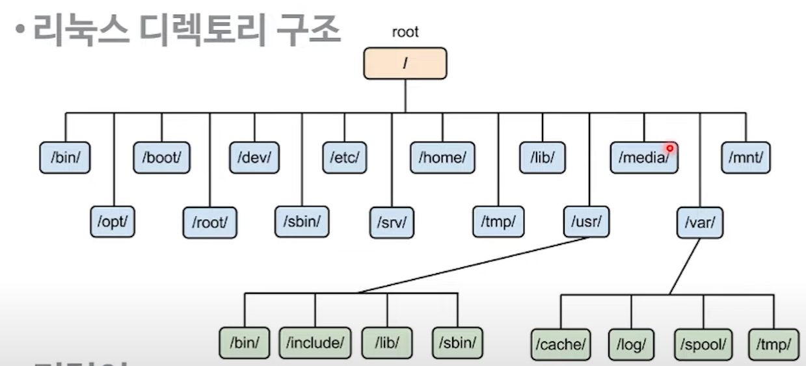

# linux part 1

## 리눅스 디렉토리

### 명령어
* pwd
    * 현재 디렉토리를 보여준다
* cd 
    * 디렉토리를 이동한다
* ls
    * 파일 목록을 보여준다

> 최상의 디렉토리 밑에는 서브 디렉토리가 존재하면서 관리를 한다

### 디렉토리 역할
* /
    * 최상의 디렉토리
* /bin
    * 커맨드 들이 저장되어 있는 공간이다(기본명령어)
* /sbin
    * 시스템이 운영하는데 필요한 명령어가 들어 있는 공간
* /usr
    * 애플리케이션이나 유틸리티 설치 디렉토리
* /lib 
    * 여러 라이브러리가 존재 하는 파일
* /etc
    * 시스템 정보(로그인 할수 있는 모든 유저 정보등)
* /var
    * 자주 변하는 파일(log등)
* /tmp
    * 임시로 저장하는 파일이 존재
* /proc
    * 메모리에서 동작중인 프로세스 정보를 확인
* /sys
    * 시스템 하드웨어 정보가 들어 있다
* /root
    * 시스템 최고 관리자인 root 사용자의 홈디렉토리
* /home
    * 일반 사용자들의 홈디렉토리
* /dev
    * 하드웨어 장치 파일